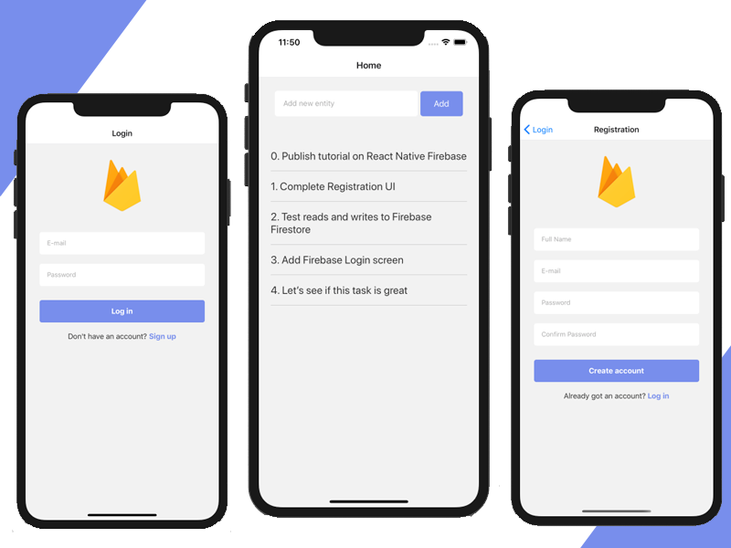
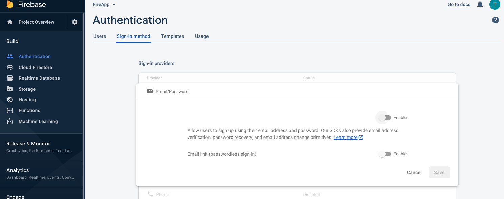
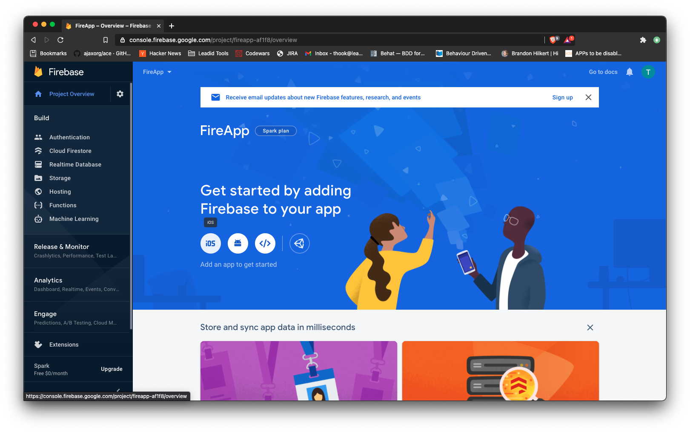
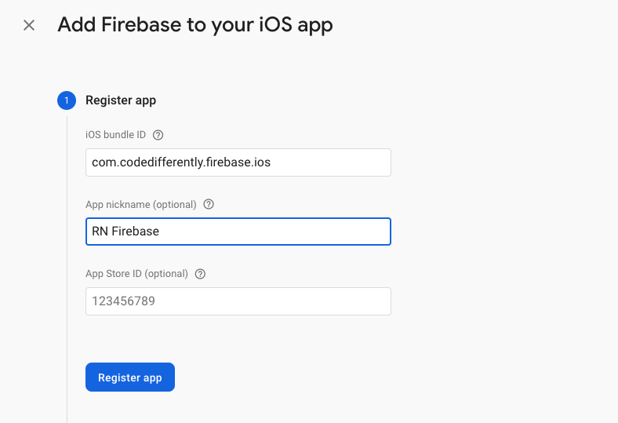
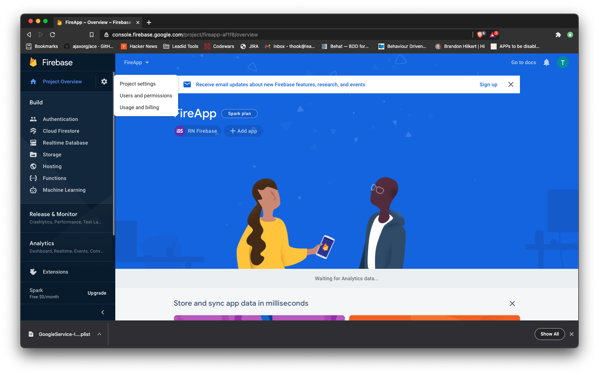
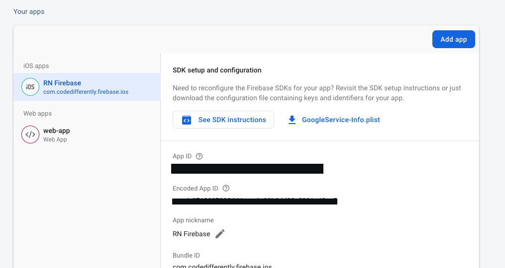
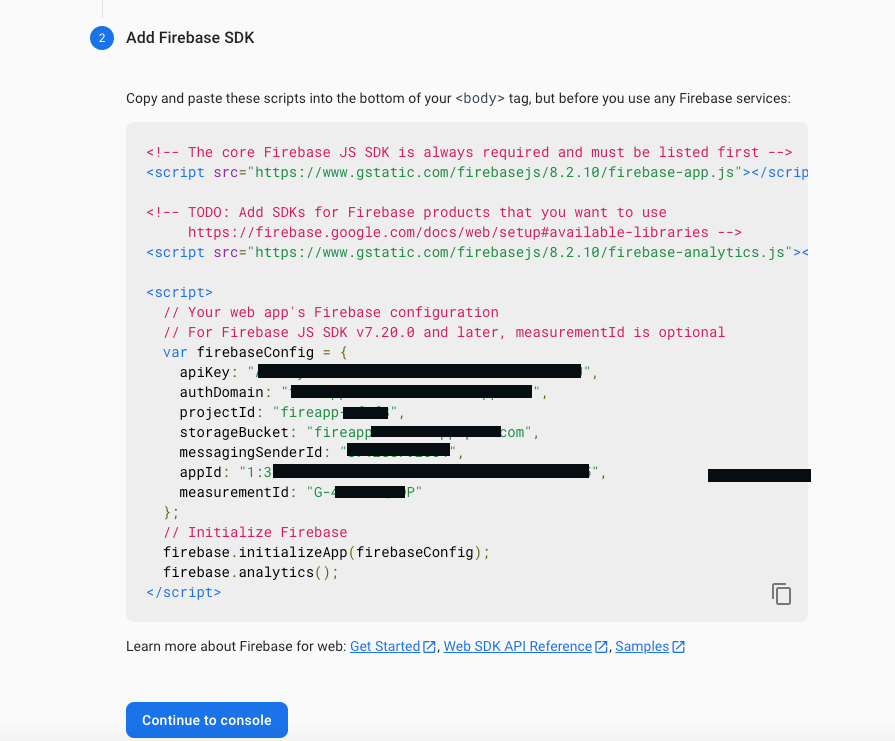
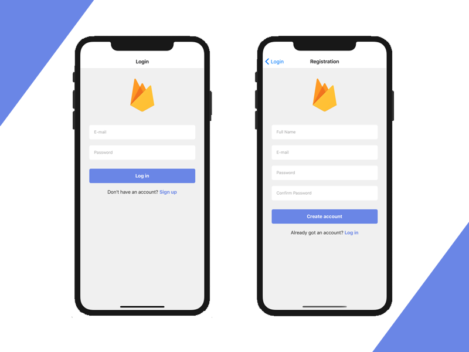
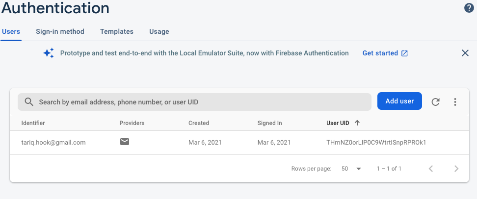

# React Native and Firebase Part 1

In this tutorial, we are going to build a React Native app that is integrated with a Firebase backend. The app will support both the React Native CLI as well as Expo CLI.

This React Native Firebase tutorial will cover the main features such as authentication, registration, and database (Firestore) CRUD operations.

This tutorial will walk you through the details of the following sections:

1. Creating a Firebase project
2. Creating & configuring a new React Native app
3. Setting up the folder structure, routes, and navigation
4. Implementing the UI for Login, Registration, and Home screens
5. Registration with Firebase Auth
6. Login with Firebase Auth
7. Persistent Login Credentials
8. Writing and reading data from Firebase Firestore

Without further ado, let’s start building out the React Native Firebase project. The final mobile app will look like this:




## 1. Create a Firebase Project

Head over to [Firebase.com](https://firebase.google.com/) and create a new account. Once logged in, you’ll be able to create a new project in the Firebase Console.

* Create a new account on Firebase.com
* Create a new project in Firebase Console
	* Enter a name of Project <~FireApp~> 	
* Enable Email & Password auth method in Firebase Console -> Authentication -> Sign-in method



* Now Select Project Overview, and select the IOS app button



* Create a new IOS app, with the APP ID com.codedifferently.firebase.ios



* (Optional) Create a new Android app with package name com.codedifferently.firebase.andriod
* Download the configuration file generated at the next step to your computer (GoogleService-Info.plist for iOS, and google-services.json for Android)

Firebase allows you to build backendless apps. It’s a product running on top of Google Cloud, and allows developers to build web and mobile apps without needing their own servers.

This saves a lot of time, since you don’t need to write any backend code. It’s also highly scalable, being backed by Google infrastructure.

In Firebase, you’ll be able to store everything that’s needed for your app — users, data, files, push notification tokens, etc. All this information is made available to the mobile clients via the Firebase SDKs, which are compatible with React Native. This means that all the interactions with the backend is abstracted out and encapsulated in the SDK, so mobile developers don’t need to worry about API calls, data parsing, sockets management, and so on.

## 2. Create and Configure a New React Native App

We’re going to make our React Native Firebase app compatible with both Expo CLI and React Native CLI.

We’re going to use Expo for now, since it makes it easy for newcomers to preview their apps. But we won’t use any Expo specific libraries, so the src code can be simply used in any React Native app, regardless of its scaffolding.

We are going to use the Firebase Web SDK, which is compatible with both Expo and React Native CLI, and is supported directly by Google.

If you want to use react-native-firebase instead, feel free to install and configure that (the code will still be the same). But keep in mind that we don’t recommend it for a few reasons:

* it is not directly supported by Google, so maintaining it will be much harder given it’s an extra layer that can cause bugs, and
* it also doesn’t work with Expo, which can be a deal breaker for many developers.


> If you do not have expo cli installed do the following: npm install -g expo-cli

Go to your project folder in the terminal and run the following command:

```
expo init react-native-firebase

```

* For the template, choose the Managed Workflow — Blank

* Change into the react-native-firebase directory

```
cd react-native-firebase
```

* Run the app in the IOS simulator 

```
npm run ios
```

This will also present you with a QR code which you can scan using the Camera app on iOS, or the Expo app on Android.

This is great. We now have a new React Native app, running on both iOS and Android. Let’s start connecting it to your Firebase backend.

* Add the Firebase SDK to the React Native project

```
 npm install firebase
```

* Use NPM to install additional packages

```
npm install @react-navigation/native && npm install @react-navigation/stack 
```

* Use Expo to install additional packages

```


```

* Add various UI components and packages to be used in the project

```
npm install react-native-keyboard-aware-scroll-view base-64
```

* Create a Firebase config file

```
mkdir src src/firebase && touch src/firebase/config.js
```

Add your firebase configuration into src/firebase/config.js:

```
import * as firebase from 'firebase';
import '@firebase/auth';
import '@firebase/firestore';

const firebaseConfig = {
  apiKey: 'YOUR_KEY_HERE_AIzaSyAOWH',
  authDomain: 'your-auth-domain-b1234.firebaseapp.com',
  databaseURL: 'https://your-database-name.firebaseio.com',
  projectId: 'your-project-id-1234',
  storageBucket: 'your-project-id-1234.appspot.com',
  messagingSenderId: '12345-insert-yourse',
  appId: 'insert yours: 1:1234:web:ee873bd1234c0deb7eba61ce',
};

firebase.initializeApp(firebaseConfig);
export { firebase };
```

You can get all this information from Firebase Console -> Project Settings

Add a new App WebBased:








## 3. Create the Folder Structure and Set Up Routes and Navigation

* Create the folder structure by running 

```
mkdir src/screens src/screens/LoginScreen src/screens/RegistrationScreen src/screens/HomeScreen

```

* Create the files structure by running

```
touch src/screens/index.js src/screens/LoginScreen/LoginScreen.js src/screens/LoginScreen/styles.js src/screens/RegistrationScreen/RegistrationScreen.js src/screens/styles.js src/screens/HomeScreen/HomeScreen.js src/screens/HomeScreen/styles.js

```

* Add this code to src/screens/index.js

```
export { default as LoginScreen } from './LoginScreen/LoginScreen'

export { default as HomeScreen } from './HomeScreen/HomeScreen'

export { default as RegistrationScreen } from './RegistrationScreen/RegistrationScreen'
```

Don’t worry if the project is broken! Everything will make sense in a little while.

* Set up the routes & navigators

Override App.js file with the following code snippet:

```
import 'react-native-gesture-handler';
import React from 'react'
import { NavigationContainer } from '@react-navigation/native'
import { createStackNavigator } from '@react-navigation/stack'
import { LoginScreen, HomeScreen, RegistrationScreen } from './src/screens'
import {decode, encode} from 'base-64'
if (!global.btoa) {  global.btoa = encode }
if (!global.atob) { global.atob = decode }

const Stack = createStackNavigator();

export default function App() {

  return (
    <NavigationContainer>
      <Stack.Navigator>
          <>
            <Stack.Screen name="Login" component={LoginScreen} />
            <Stack.Screen name="Registration" component={RegistrationScreen} />
            <Stack.Screen name="Home" component={HomeScreen}/>
            
          </>
      </Stack.Navigator>
    </NavigationContainer>
  );
}
```

## 4. Implement the UI

Now that we have the scaffold of the app, let’s go ahead and implement the UI components of all screens. We’re not going into the details of flex layout and React Native styling, since that is outside the scope for this tutorial. We’re going to focus mostly on React Native Firebase integration.

Simply override the files as follows:

* src/LoginScreen/LoginScreen.js

```
import React, { useState } from 'react'
import { Image, Text, TextInput, TouchableOpacity, View } from 'react-native'
import { KeyboardAwareScrollView } from 'react-native-keyboard-aware-scroll-view';
import styles from './styles';

export default function LoginScreen({navigation}) {
    const [email, setEmail] = useState('')
    const [password, setPassword] = useState('')

    const onFooterLinkPress = () => {
        navigation.navigate('Registration')
    }

    const onLoginPress = () => {
    }

    return (
        <View style={styles.container}>
            <KeyboardAwareScrollView
                style={{ flex: 1, width: '100%' }}
                keyboardShouldPersistTaps="always">
                <Image
                    style={styles.logo}
                    source={require('../../../assets/icon.png')}
                />
                <TextInput
                    style={styles.input}
                    placeholder='E-mail'
                    placeholderTextColor="#aaaaaa"
                    onChangeText={(text) => setEmail(text)}
                    value={email}
                    underlineColorAndroid="transparent"
                    autoCapitalize="none"
                />
                <TextInput
                    style={styles.input}
                    placeholderTextColor="#aaaaaa"
                    secureTextEntry
                    placeholder='Password'
                    onChangeText={(text) => setPassword(text)}
                    value={password}
                    underlineColorAndroid="transparent"
                    autoCapitalize="none"
                />
                <TouchableOpacity
                    style={styles.button}
                    onPress={() => onLoginPress()}>
                    <Text style={styles.buttonTitle}>Log in</Text>
                </TouchableOpacity>
                <View style={styles.footerView}>
                    <Text style={styles.footerText}>Don't have an account? <Text onPress={onFooterLinkPress} style={styles.footerLink}>Sign up</Text></Text>
                </View>
            </KeyboardAwareScrollView>
        </View>
    )
}
```

* src/LoginScreen/styles.js

```
import { StyleSheet } from 'react-native';

export default StyleSheet.create({
    container: {
        flex: 1,
        alignItems: 'center'
    },
    title: {

    },
    logo: {
        flex: 1,
        height: 120,
        width: 90,
        alignSelf: "center",
        margin: 30
    },
    input: {
        height: 48,
        borderRadius: 5,
        overflow: 'hidden',
        backgroundColor: 'white',
        marginTop: 10,
        marginBottom: 10,
        marginLeft: 30,
        marginRight: 30,
        paddingLeft: 16
    },
    button: {
        backgroundColor: '#788eec',
        marginLeft: 30,
        marginRight: 30,
        marginTop: 20,
        height: 48,
        borderRadius: 5,
        alignItems: "center",
        justifyContent: 'center'
    },
    buttonTitle: {
        color: 'white',
        fontSize: 16,
        fontWeight: "bold"
    },
    footerView: {
        flex: 1,
        alignItems: "center",
        marginTop: 20
    },
    footerText: {
        fontSize: 16,
        color: '#2e2e2d'
    },
    footerLink: {
        color: "#788eec",
        fontWeight: "bold",
        fontSize: 16
    }
})
```

* src/RegistrationScreen/RegistrationScreen.js

```
import React, { useState } from 'react'
import { Image, Text, TextInput, TouchableOpacity, View } from 'react-native'
import { KeyboardAwareScrollView } from 'react-native-keyboard-aware-scroll-view';
import styles from './styles';

export default function RegistrationScreen({navigation}) {
    const [fullName, setFullName] = useState('')
    const [email, setEmail] = useState('')
    const [password, setPassword] = useState('')
    const [confirmPassword, setConfirmPassword] = useState('')

    const onFooterLinkPress = () => {
        navigation.navigate('Login')
    }

    const onRegisterPress = () => {
    }

    return (
        <View style={styles.container}>
            <KeyboardAwareScrollView
                style={{ flex: 1, width: '100%' }}
                keyboardShouldPersistTaps="always">
                <Image
                    style={styles.logo}
                    source={require('../../../assets/icon.png')}
                />
                <TextInput
                    style={styles.input}
                    placeholder='Full Name'
                    placeholderTextColor="#aaaaaa"
                    onChangeText={(text) => setFullName(text)}
                    value={fullName}
                    underlineColorAndroid="transparent"
                    autoCapitalize="none"
                />
                <TextInput
                    style={styles.input}
                    placeholder='E-mail'
                    placeholderTextColor="#aaaaaa"
                    onChangeText={(text) => setEmail(text)}
                    value={email}
                    underlineColorAndroid="transparent"
                    autoCapitalize="none"
                />
                <TextInput
                    style={styles.input}
                    placeholderTextColor="#aaaaaa"
                    secureTextEntry
                    placeholder='Password'
                    onChangeText={(text) => setPassword(text)}
                    value={password}
                    underlineColorAndroid="transparent"
                    autoCapitalize="none"
                />
                <TextInput
                    style={styles.input}
                    placeholderTextColor="#aaaaaa"
                    secureTextEntry
                    placeholder='Confirm Password'
                    onChangeText={(text) => setConfirmPassword(text)}
                    value={confirmPassword}
                    underlineColorAndroid="transparent"
                    autoCapitalize="none"
                />
                <TouchableOpacity
                    style={styles.button}
                    onPress={() => onRegisterPress()}>
                    <Text style={styles.buttonTitle}>Create account</Text>
                </TouchableOpacity>
                <View style={styles.footerView}>
                    <Text style={styles.footerText}>Already got an account? <Text onPress={onFooterLinkPress} style={styles.footerLink}>Log in</Text></Text>
                </View>
            </KeyboardAwareScrollView>
        </View>
    )
}
```

* src/RegistrationScreen/styles.js

```
import { StyleSheet } from 'react-native';

export default StyleSheet.create({
    container: {
        flex: 1,
        alignItems: 'center'
    },
    title: {

    },
    logo: {
        flex: 1,
        height: 120,
        width: 90,
        alignSelf: "center",
        margin: 30
    },
    input: {
        height: 48,
        borderRadius: 5,
        overflow: 'hidden',
        backgroundColor: 'white',
        marginTop: 10,
        marginBottom: 10,
        marginLeft: 30,
        marginRight: 30,
        paddingLeft: 16
    },
    button: {
        backgroundColor: '#788eec',
        marginLeft: 30,
        marginRight: 30,
        marginTop: 20,
        height: 48,
        borderRadius: 5,
        alignItems: "center",
        justifyContent: 'center'
    },
    buttonTitle: {
        color: 'white',
        fontSize: 16,
        fontWeight: "bold"
    },
    footerView: {
        flex: 1,
        alignItems: "center",
        marginTop: 20
    },
    footerText: {
        fontSize: 16,
        color: '#2e2e2d'
    },
    footerLink: {
        color: "#788eec",
        fontWeight: "bold",
        fontSize: 16
    }
})
```

* src/HomeScreen/HomeScreen.js

```
import React from 'react'
import { Text, View } from 'react-native'

export default function HomeScreen(props) {
    return (
        <View>
            <Text>Home Screen</Text>
        </View>
    )
}
```

* src/HomeScreen/styles.js

```
import { StyleSheet } from 'react-native';

export default StyleSheet.create({
    container: {
        flex: 1,
        alignItems: 'center'
    },
    input: {
        height: 48,
        borderRadius: 5,
        overflow: 'hidden',
        backgroundColor: 'white',
        marginTop: 10,
        marginBottom: 10,
        marginLeft: 30,
        marginRight: 30,
        paddingLeft: 16
    }
})
```

At this point, your app should run properly and display the following screens (UI only):



You can switch between the two screens by tapping the links buttons in the footer.

Now that we have a beautiful UI for login and sign up, let’s see how we can integrate our React Native (and Expo) app with Firebase.

## 5. React Native Firebase — Registration

Let’s start with creating a new account with Firebase Auth, since naturally login comes after. For this, we are going to add the Firebase logic for creating a new account with email & password in RegistrationScreen.js, by implementing the onRegisterPress method as follows:

```
...

...

import { firebase } from '../../firebase/config'

...

export default function RegistrationScreen({navigation}) {
    ...

    const onRegisterPress = () => {
        if (password !== confirmPassword) {
            alert("Passwords don't match.")
            return
        }
        firebase
            .auth()
            .createUserWithEmailAndPassword(email, password)
            .then((response) => {
                const uid = response.user.uid
                navigation.navigate('Home', {user: data})
            })
            .catch((error) => {
                alert(error)
        });
    }
    
    ...
}
```

In the account creation flow above, we do a few important things:

* We call Firebase Auth’s createUserWithEmailAndPassword API (line 13), which creates a new account that will show up in Firebase Console -> Authentication table.
* If the account registration was successful, we also store the user data in Firebase Firestore (line 24). This is necessary for storing extra user information, such as full name, profile photo URL, and so on, which cannot be stored in the Authentication table.
* If registration was successful, we navigate to the Home Screen, by passing in the user object data as well.
* If any error occurs, we simply show an alert with it. Errors can be things such as no network connection, password too short, email invalid, and so on.

Reload your app and test the registration. If you successfully created one account, check that it shows up in Firebase Console -> Authentication:



## React Native Firebase — Login

Now that we are able to create new accounts, let’s implement the login functionality. Firebase SDK takes care of all the authorization and authentication steps needed for a secure login.

Open LoginScreen.js, import firebase and complete the onLoginPress method:

```
...

import { firebase } from '../../firebase/config'

...

export default function LoginScreen({navigation}) {

    ...

    const onLoginPress = () => {
        firebase
            .auth()
            .signInWithEmailAndPassword(email, password)
            .then((response) => {
                const user = response.user;
                navigation.navigate('Home', {user})
            })
            .catch(error => {
                alert(error)
            })
    }

    ...

}
```

Reload your app and go ahead and login with an existing account. The app should take you to the home screen if the credentials were correct, or it will alert you with an error if anything went wrong.